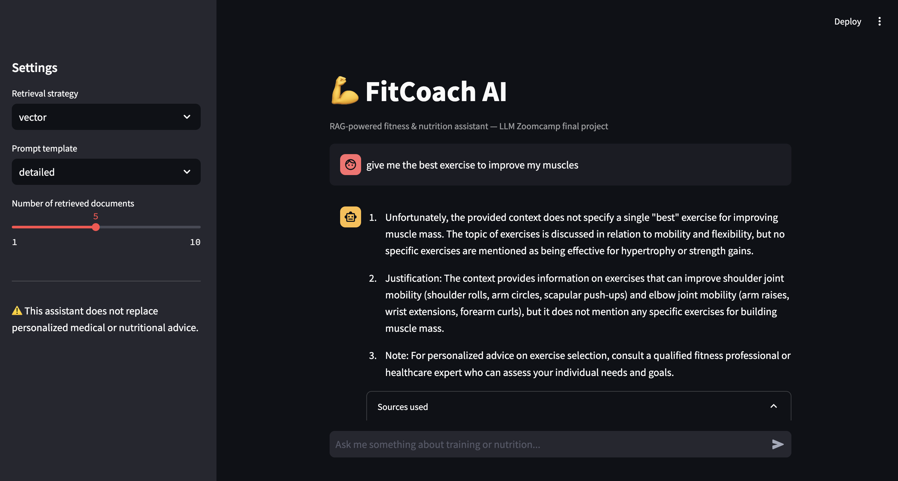
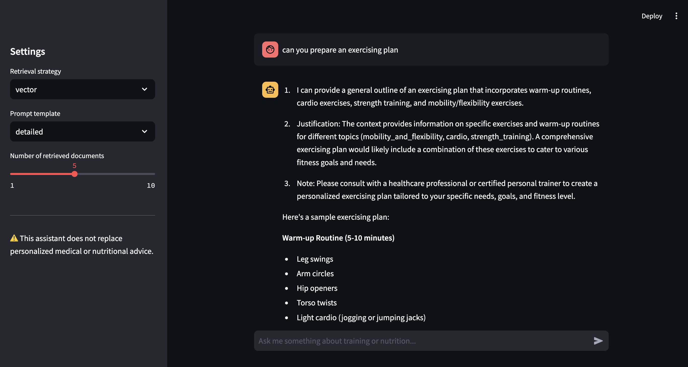
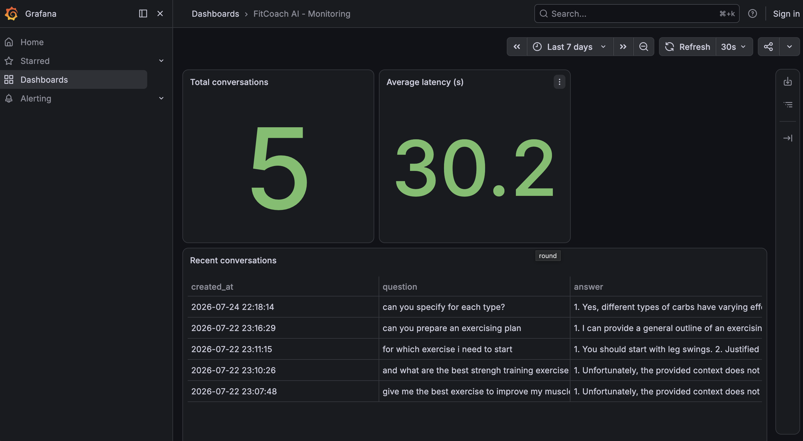

# 💪 FitCoach AI — RAG Fitness & Nutrition Assistant

Project Purpose:

> A conversational assistant that answers questions about training, nutrition,
> recovery, and injury prevention, using a fully local RAG (Retrieval-Augmented
> Generation) architecture built with Ollama and Qdrant.

> **Note**: This project was developed with AI assistance.

---

## Table of contents

- [Problem description](#problem-description)
- [Dataset](#dataset)
- [Architecture](#architecture)
- [Tech stack](#tech-stack)
- [How to run the project](#how-to-run-the-project)
- [How to use it](#how-to-use-it)
- [Evaluation](#evaluation)
- [Monitoring](#monitoring)
- [Course evaluation criteria mapping](#course-evaluation-criteria-mapping)
- [Repository structure](#repository-structure)
- [Limitations and future work](#limitations-and-future-work)

---

## Problem description

Finding reliable, quick answers about fitness and nutrition is hard: information
is scattered across sources of wildly varying quality, and many users don't
know what to ask or how to interpret generic advice. **FitCoach AI** solves
this by offering a conversational assistant that answers based on a curated
knowledge base (not free-form LLM hallucination), shows the sources it used,
and is continuously evaluated to make sure its answers stay relevant and
faithful to the retrieved context.

It is not a substitute for professional medical advice — the app makes that
explicit.

## Dataset

Since the course's own FAQ dataset can't be reused, a **synthetic dataset**
was generated with an LLM (Ollama), covering 10 topics and ~30 subtopics of
fitness and nutrition (strength training, cardio, mobility, recovery,
macronutrients, hydration, supplements, weight management, injury prevention,
special populations). Each subtopic yields several question/answer pairs,
resulting in a corpus of several hundred documents.
See [`data/generate_dataset.py`](data/generate_dataset.py).

For retrieval evaluation, a **ground truth** set was additionally generated:
for each document, the LLM creates 3 alternative ways of asking the same
question, simulating real user queries
([`data/generate_ground_truth.py`](data/generate_ground_truth.py)).

## Architecture

```
                    ┌─────────────┐
        User   ───▶ │  Streamlit  │
                    └──────┬──────┘
                           │
              ┌────────────┼─────────────┐
              ▼            ▼             ▼
        ┌──────────┐ ┌───────────┐ ┌───────────┐
        │  Qdrant  │ │   BM25    │ │  Postgres │
        │ (vector) │ │  (text)   │ │(feedback) │
        └────┬─────┘ └─────┬─────┘ └─────┬─────┘
             │             │             │
             └──────┬──────┘             │
                     ▼                   ▼
              Hybrid retrieval      ┌──────────┐
                     │              │ Grafana  │
                     ▼              │(dashboard)│
              ┌─────────────┐       └──────────┘
              │   Ollama    │
              │ (local LLM) │
              └─────────────┘
```

Flow: question → context retrieval (vector, text, or hybrid) → prompt
construction → answer generation by the LLM → answer + sources shown to the
user → feedback (👍/👎) stored in Postgres → visible on the Grafana dashboard.

## Tech stack

| Layer | Tool | Note |
|---|---|---|
| LLM | [Ollama](https://ollama.com) (llama3.2) | Fully local, no API costs |
| Embeddings | Ollama (nomic-embed-text) | |
| Vector store | [Qdrant](https://qdrant.tech) | |
| Text search | [rank-bm25](https://pypi.org/project/rank-bm25/) | Python library, no extra service |
| Interface | [Streamlit](https://streamlit.io) | chat + sources + feedback |
| Feedback / logs | PostgreSQL | |
| Monitoring | [Grafana](https://grafana.com) | dashboard with 6 charts |
| Containerization | Docker Compose | all services |

None of these tools require paid API keys — the project runs entirely
offline once the models have been downloaded.

## How to run the project

### Prerequisites
- Docker and Docker Compose installed
- [Ollama](https://ollama.com/download) installed **natively on your machine**
  (strongly recommended, especially on macOS — see note below)
- ~8 GB of free RAM
- Python 3.11+ (only needed to run the data generation/ingestion/evaluation scripts from the host)

> **Why native Ollama instead of a container?** Docker Desktop on macOS runs
> containers inside a Linux VM that cannot access Apple's Metal GPU. Ollama
> running *inside* a container on macOS is therefore CPU-only and can be
> 10-50x slower than Ollama installed natively, which uses Metal
> acceleration automatically. This project defaults to native Ollama for
> that reason. If you're on Linux with an NVIDIA GPU, or simply prefer not
> to install anything on the host, see the "containerized Ollama" option below.

### Step by step (recommended: native Ollama)

```bash
git clone fitcoach-ai
cd fitcoach-ai

# 0. Install Ollama natively if you haven't: https://ollama.com/download
#    Then make sure it's running (the installer usually starts it automatically):
ollama serve &

# 1. Pull the required models (first time only)
make pull-models-native

# 2. Start the containerized services (qdrant, postgres, grafana, app)
#    The app is pre-configured to reach your host's Ollama automatically.
make up
or 
docker compose -f 'docker-compose.yml' up -d --build 

# 3. Create a local virtual environment and install dependencies into it
#    (macOS/Homebrew Python blocks system-wide `pip install`, so this is required)
python -m venv .venv
source .venv/bin/activate
pip install -r requirements.txt
or
make venv

# 4. Generate the synthetic dataset (takes a few minutes)
make generate-data

# 5. Generate the ground truth for retrieval evaluation
make generate-ground-truth

# 6. Automated ingestion: embeddings + Qdrant indexing + BM25 index
make ingest

# 7. (optional) Run the evaluations
make eval-retrieval
make eval-llm
```

After this:
- **App**: http://localhost:8501
- **Grafana**: http://localhost:3000 (login: `admin` / `admin`, or anonymous access is already enabled)
- **Qdrant dashboard**: http://localhost:6333/dashboard

### Alternative: fully containerized Ollama

If you'd rather not install Ollama natively (e.g. on Linux, or for a fully
self-contained demo), you can run it inside Docker instead:

```bash
make up-with-ollama          # starts ollama, qdrant, postgres, grafana, app
make pull-models              # pulls models into the ollama container
```

Then set `OLLAMA_URL=http://ollama:11434` in a `.env` file (copy from
[`.env.example`](.env.example)) before starting. Note this path is
significantly slower on macOS (see note above).

Versions are pinned in [`requirements.txt`](requirements.txt) and in the
Docker images in [`docker-compose.yml`](docker-compose.yml).

### Troubleshooting: slow generation / timeouts

Even with native Ollama, larger models can take a while on machines without
a discrete GPU. If you see `Read timed out` errors:

1. **Increase the timeout** (default is 600s for generation, 120s for
   embeddings) via the `OLLAMA_TIMEOUT` env var if needed:
   ```bash
   OLLAMA_TIMEOUT=1200 make generate-data
   ```
2. **Use a smaller, faster model**, e.g. `llama3.2:1b`:
   ```bash
   ollama pull llama3.2:1b
   OLLAMA_MODEL=llama3.2:1b make generate-data
   OLLAMA_MODEL=llama3.2:1b make generate-ground-truth
   ```
   (Use the same `OLLAMA_MODEL` when running the app/evaluation, or set it
   permanently in `.env`.)
3. **Sanity-check Ollama directly** and check the timing breakdown:
   ```bash
   time curl http://localhost:11434/api/generate -d '{"model":"llama3.2","prompt":"Say hello in one word","stream":false}'
   ```
   If this simple request takes tens of seconds even with Ollama installed
   natively, check Activity Monitor for CPU throttling, close other
   memory-heavy apps, or switch to the `:1b` model above.

## How to use it

1. Open http://localhost:8501
2. Type a question, e.g.: *"How much protein should I eat daily to build muscle?"*
3. The answer appears along with the sources used (expand "Sources used")
4. Use 👍/👎 to give feedback — this feeds the monitoring dashboard
5. In the sidebar you can switch the retrieval strategy (`vector`, `text`, `hybrid`) and the prompt template (`concise`, `detailed`)

### Screenshots

**Streamlit App Interface:**


**LLM Response with Sources:**


**Grafana Monitoring Dashboard:**


## Evaluation

### Retrieval

[`evaluation/retrieval_eval.py`](evaluation/retrieval_eval.py) compares three
strategies — vector search (Qdrant), text search (BM25), and hybrid search
(Reciprocal Rank Fusion) — using **hit-rate** and **MRR** against the
generated ground truth. The strategy with the best MRR is chosen as the
app's default (configurable via `SEARCH_STRATEGY`).

Example results (see `evaluation/retrieval_results.json` after running):

| Strategy | Hit-rate | MRR |
|---|---|---|
| vector | fill in after run | |
| text (BM25) | fill in after run | |
| hybrid | fill in after run | |

### LLM (final answer)

[`evaluation/llm_eval.py`](evaluation/llm_eval.py) compares two prompt
templates (`concise` vs `detailed`, see [`rag/prompts.py`](rag/prompts.py))
using an **LLM-as-a-judge**: Ollama itself rates each answer on *relevance*
and *faithfulness* (1–5), over a sample of the ground truth. The template
with the best combined score is chosen as the default.

## Monitoring

Every conversation (question, answer, latency, strategy used, topic,
feedback) is logged into the `conversations` table in Postgres
([`db/init.sql`](db/init.sql)). The Grafana dashboard
([`monitoring/grafana/dashboards/fitcoach_dashboard.json`](monitoring/grafana/dashboards/fitcoach_dashboard.json))
is automatically provisioned with 6 panels:

1. Questions volume over time
2. Positive feedback rate (gauge)
3. Average answer latency
4. Questions by topic (bar chart)
5. Retrieval strategy used (pie chart)
6. Table of recent conversations

## Course evaluation criteria mapping

| Criterion | Where to find it |
|---|---|
| Problem description | [Problem description](#problem-description) section |
| Retrieval flow (KB + LLM) | [`rag/pipeline.py`](rag/pipeline.py), [`rag/search.py`](rag/search.py) |
| Retrieval evaluation (multiple approaches) | [`evaluation/retrieval_eval.py`](evaluation/retrieval_eval.py) — vector, text, hybrid |
| LLM evaluation (multiple approaches) | [`evaluation/llm_eval.py`](evaluation/llm_eval.py) — 2 prompts, LLM-as-judge |
| Interface | Streamlit app ([`app.py`](app.py)) |
| Automated ingestion pipeline | [`ingestion/ingest.py`](ingestion/ingest.py) + `make ingest` |
| Monitoring (feedback + 5+ chart dashboard) | [`db/monitoring_db.py`](db/monitoring_db.py) + Grafana (6 charts) |
| Containerization (full docker-compose) | [`docker-compose.yml`](docker-compose.yml) |
| Reproducibility | [How to run the project](#how-to-run-the-project) section, pinned versions |
| Best practice: hybrid search | [`rag/search.py`](rag/search.py) `hybrid_search()` (RRF) |

## Repository structure

```
fitcoach-ai/
├── app.py                     # Streamlit interface
├── docker-compose.yml
├── Dockerfile
├── Makefile
├── requirements.txt
├── .env.example
├── data/
│   ├── generate_dataset.py        # Synthetic dataset generation
│   ├── generate_ground_truth.py   # Ground truth generation for evaluation
│   ├── dataset.json                (generated)
│   └── ground_truth.json           (generated)
├── ingestion/
│   └── ingest.py               # Embeddings + Qdrant indexing + BM25
├── rag/
│   ├── search.py               # vector / text / hybrid retrieval
│   ├── prompts.py               # prompt templates
│   ├── llm.py                   # Ollama call + LLM-as-judge
│   └── pipeline.py              # orchestrates retrieval + prompt + LLM
├── evaluation/
│   ├── retrieval_eval.py       # hit-rate / MRR per strategy
│   └── llm_eval.py              # comparative prompt evaluation
├── db/
│   ├── init.sql                 # Postgres schema
│   └── monitoring_db.py         # conversation/feedback logging
└── monitoring/
    └── grafana/                 # provisioning + dashboard JSON
```

## Limitations and future work

- The dataset is synthetic; it doesn't replace validation with real users.
- Document re-ranking and query rewriting are not implemented yet — natural
  candidates for extra "best practices" points.
- Cloud deployment is not included in this version (possible bonus: Fly.io / Render / AWS).
- The LLM-as-judge uses the same model that generates the answers, which can
  introduce bias; using a different judge model would improve the evaluation.
